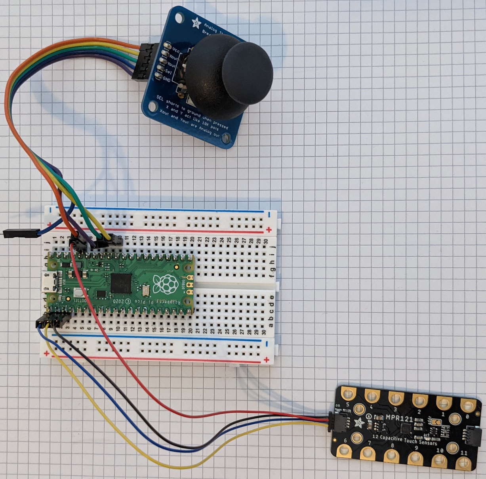

# USB Joystick with Touch Inputs

USB joystick with 2 axes, 8 button inputs, and 12 cap touch inputs.
Unused inputs can be left unconnected except the analog inputs will generate
noise. Use the joystick_alltouch demo if analog joysticks are not needed.

## Hardware

* Raspberry Pi Pico
* Adafruit MPR121 Gator Breakout https://www.adafruit.com/product/4830
* STEMMA QT/Qwicc JST cable with header pins https://www.adafruit.com/product/4209
* Generic 2 axis analog joystick or thumbstick
* buttons for button inputs
* conductive material for touch inputs
* DuPont wire for joystick

## Software

This project is based on the Raspberry Pi Pico using the Arduino IDE with the
following board package. See the web site for installation instructions.

https://github.com/earlephilhower/arduino-pico

The following Arduino libraries may be installed using the IDE Library Manager.

* Adafruit BusIO
* Adafruit MPR121
* Bounce2

## Hook up

### Joystick/Thumbstick

Two axis joystick mounted on a circuit board has pins labeled like this. The labels
vary from one vendor to another. Many thumbsticks are also buttons. If present,
the button can be ignored (left unconnected) or it can be connected to a button input
such as GP4.

Joystick|Raspberry Pi Pico
--------|-----------------
Vcc, +5V|3v3 OUT (pin 36)
Xout,VRX|GP26_A0 (pint 31)
Yout,VRY|GP27_A1 (pin 32)
Sel, SW |GP4 (pin 6), optional
Gnd     |AGND (pin 33)

### Touch Inputs

The 12 capacitive touch inputs are provided by an MPR121 board. The MPR121
board connects to the Pi Pico via I2C bus. The Adafruit MPR121 Gator board is
easy to use but a generic MPR121 board will also work.

MPR121  |Cable  |Raspberry Pi Pico
--------|-------|-----------------
3.3V    |Red    |3V3_OUT (pin 36)
GND     |Black  |GND (pin 3)
SCL     |Blue   |GP1, I2C0_SCL (pin 2)
SDA     |Yellow |GP0, I2C0_SDA (pin 1)

Touch input 0 corresponds to joystick button 1, touch input 1 corresponds to
button 2, and so on.

### Button Inputs

The following GPIO pins are configured as button inputs.

Button  |Raspberry Pi Pico
--------|-----------------
1       |GP4 (pin 6)
2       |GP5 (pin 7)
3       |GP6 (pin 9)
4       |GP7 (pin 10)
5       |GP8 (pin 11)
6       |GP9 (pin 12)
7       |GP10 (pin 14)
8       |GP11 (pin 15)
